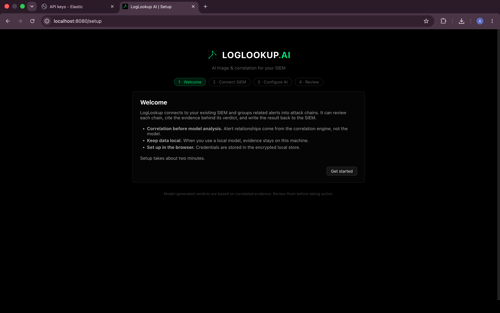
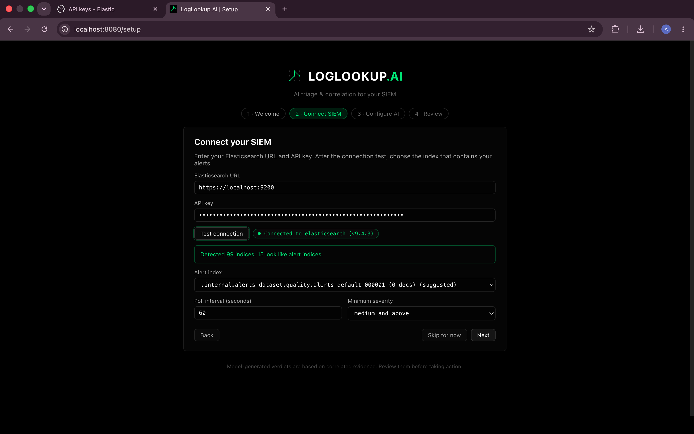
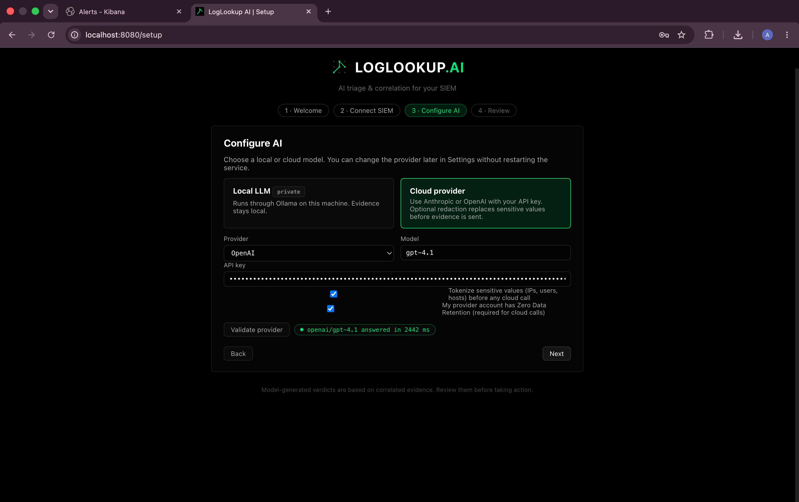
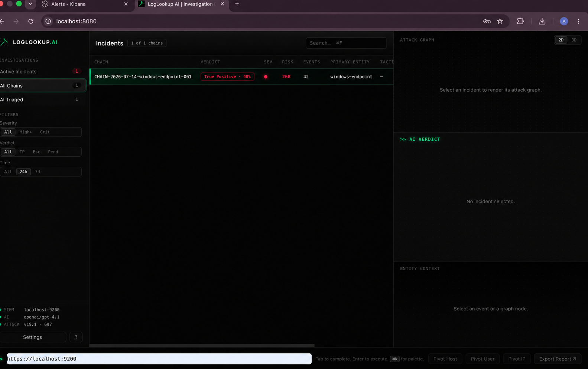
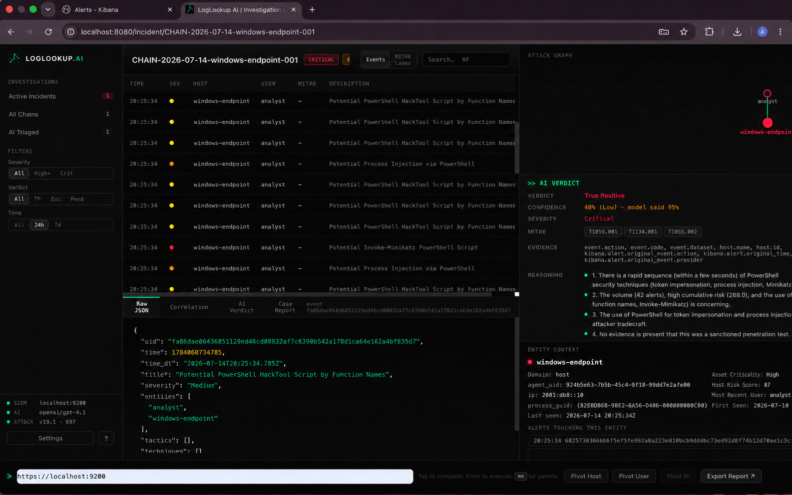
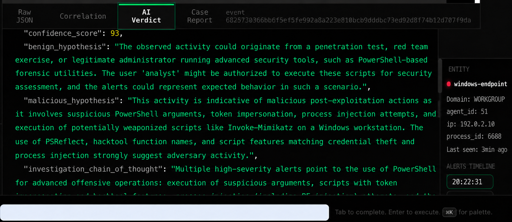
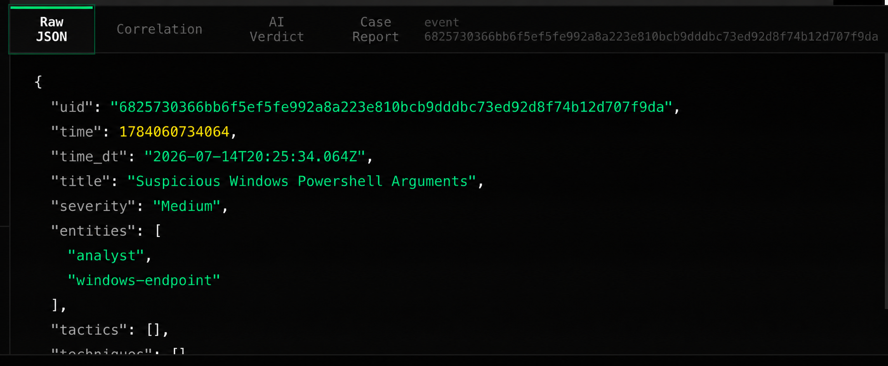
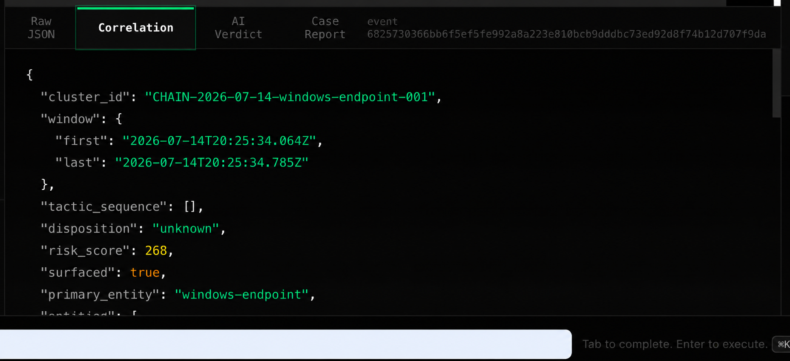
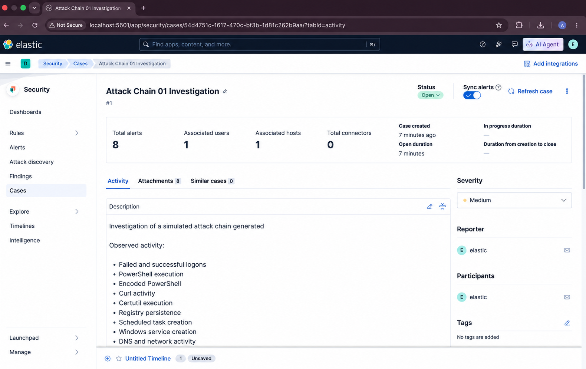

# User Guide

## 1. Before You Start

LogLookup AI works alongside Elastic Security. For a live deployment, you need:

- a Linux host with Python 3.11, 3.12, or 3.13;
- an Elasticsearch URL reachable from that host;
- an Elastic API key with access to the security alert index and, when enabled, the LogLookup AI results index;
- Elastic Security alerts with useful host, user, process, or network fields; and
- optionally, Ollama or credentials for a supported cloud AI provider.

AI is not required for deterministic correlation. If it is unavailable, correlated chains and raw evidence remain accessible.

## 2. Install and Open LogLookup AI

From a source checkout:

```bash
bash deploy/install.sh
loglookup open
```

The installer targets a per-user Linux environment. `loglookup open` starts the service if necessary and opens the configured dashboard URL. The default is `http://localhost:8080`.

On first launch, the browser redirects to onboarding.



*Figure 1. First-run onboarding explains the connection, correlation, and local-data model.*

## 3. Connect Elastic Security

On the **Connect SIEM** step, enter:

- the full Elasticsearch URL, including `https://` when TLS is used;
- an Elastic API key;
- the alert index or detected alert index pattern;
- the polling interval; and
- the minimum alert severity.

Keep TLS verification enabled. If Elasticsearch uses a private or self-signed CA, upload the CA certificate or provide its path. Use **Skip TLS Verification** only in an isolated lab.

Select **Test connection** before continuing. A successful test confirms authentication and index access.



*Figure 2. SIEM setup with a validated local example endpoint, masked credential, alert index, and polling policy.*

## 4. Configure AI

Choose one of the following:

- **Local model**: use a model served by Ollama on the LogLookup AI host.
- **Cloud provider**: select Anthropic or OpenAI, enter a key, and optionally choose a model.

For cloud use, review and acknowledge the zero-data-retention requirement. Leave redaction enabled unless your organization has a reviewed reason to change it. Provider validation performs a real inference request and can consume provider quota.



*Figure 3. AI configuration with a masked cloud key and an explicit validation result.*

Review the configuration and complete onboarding. Managed credentials are stored in the encrypted local secret store and are not displayed again.

## 5. Use the Incident List

The main view lists the chains currently known to the running service. Columns include the stable chain identifier, triage verdict, severity, cumulative risk, event count, primary entity, and ATT&CK context.

Use the left navigation to switch between active, all, and AI-triaged chains. Search and filter by severity, verdict, or time range. Selecting a row opens the incident workspace.



*Figure 4. A surfaced chain in the incident list before the analyst opens its evidence.*

## 6. Investigate an Incident

The incident workspace contains several synchronized areas:

- **Event table or MITRE lanes**: the chronological detections in the chain;
- **Attack graph**: relationships among events, entities, and ATT&CK techniques;
- **AI verdict**: verdict, confidence, severity, evidence fields, reasoning, and recommendations;
- **Evidence tabs**: raw JSON, correlation output, verdict data, and the case report; and
- **Entity context**: selected host, user, process, network, and related-alert details.



*Figure 5. The full incident view keeps correlated events, graph, AI reasoning, raw evidence, and entity context together.*

### Review the chain before the verdict

Start with the event order and primary entity. Confirm that the detections describe related activity and that the correlation window is plausible. Select events to update the raw-evidence and entity panes.

### Use the graph for pivots

Choose 2D or 3D mode and select a node to filter the event list and update entity context. The graph is a view of the stored chain; it does not add evidence.

### Interpret risk

Risk is cumulative for resolved entities and is calculated before AI triage. Use it for prioritization, then verify the underlying severity and event sequence. A high score is not itself a malicious verdict.

## 7. Review the AI Verdict

The AI verdict is derived from the formed chain and retrieved ATT&CK candidates. It can include a verdict, confidence, benign and malicious hypotheses, reasoning, and recommended actions.



*Figure 6. AI verdict data remains separate from the deterministic correlation and raw evidence tabs.*

Treat the verdict as investigation assistance:

1. Compare its evidence list with the selected events.
2. Confirm that cited fields are visible in the source data.
3. Review ATT&CK techniques in the context of the observed commands and behavior.
4. Consider benign administrative or testing explanations.
5. Record the analyst decision in the system used by your team.

If triage is marked unavailable, check the provider and knowledge-base status. Do not interpret an unavailable result as a benign verdict.

## 8. Inspect Raw and Correlation Evidence

The **Raw JSON** tab shows the event fields retained for investigation. Use it to confirm timestamps, rule title, severity, entities, and source-specific evidence.



*Figure 7. Raw JSON for the selected detection, including normalized time, title, severity, and entities.*

The **Correlation** tab shows the chain identifier, event window, deterministic disposition, risk score, surfacing state, and primary entity.



*Figure 8. Structured correlation data used before AI triage.*

Use these tabs to distinguish source evidence from derived analysis. Exported reports should not replace the original Elastic records.

## 9. Continue in Elastic

When write-back is enabled, LogLookup AI stores the result in the configured Elasticsearch results index with the chain identifier and a deep link to the incident workspace. Your Elastic permissions and dashboards determine how that document is surfaced in Kibana.



*Figure 9. A simulated attack-chain case in Elastic for continued analyst handling.*

## 10. Export an Investigation

Use the export control in the incident workspace to download JSON or a Markdown report. The JSON export contains the stored document plus timeline and graph views; the Markdown export is intended for a readable case summary.

Review exported data before sharing it. It can contain hostnames, users, IP addresses, commands, and other incident evidence even when cloud redaction is enabled.

## 11. Change Settings

Open **Settings** to update the AI provider or SIEM connection. In managed mode, accepted settings are applied without a process restart and persisted for the next launch. Enter a new key only when rotating a credential; existing keys are never returned to the browser.

Changing the SIEM index, severity floor, correlation policy, or risk threshold affects future ingestion and chain formation. Coordinate those changes with the team responsible for detections and incident handling.

## 12. Troubleshooting

### The dashboard does not open

Run:

```bash
loglookup status
```

For a systemd user installation, also check:

```bash
systemctl --user status loglookup
journalctl --user -u loglookup
```

### Elastic validation fails

- Confirm the endpoint includes the correct scheme and port.
- Confirm the key has access to the requested alert index.
- Check network routing and firewall policy from the LogLookup AI host.
- Verify the CA certificate and hostname used by Elasticsearch.
- Do not disable TLS verification as a general connection fix.

### No incidents appear

- Confirm Elastic Security has alerts in the configured index.
- Check the minimum severity and polling interval.
- Review pre-filter allowlists.
- Confirm alerts contain shared entities and fall within the correlation window.
- Check `/api/status` or `loglookup status` for ingestion and SIEM state.

### AI triage is unavailable

- Confirm the ATT&CK knowledge base was built.
- For Ollama, confirm the service and selected model are available.
- For a cloud provider, re-enter the key and run explicit validation.
- Check network access and provider policy.
- Continue with the deterministic evidence while the AI dependency is unavailable.

### An incident appears incorrectly correlated

Review raw timestamps, primary entities, and correlation JSON. Preserve the incident evidence before changing correlation settings, and report a reproducible example to the project maintainer.

## 13. Analyst Checklist

1. Confirm the chain represents related activity.
2. Review the event order and primary entities.
3. Inspect raw evidence for the most significant detections.
4. Compare the AI verdict with cited evidence and ATT&CK context.
5. Pivot to Elastic telemetry when more context is required.
6. Record the final analyst disposition and response actions.

