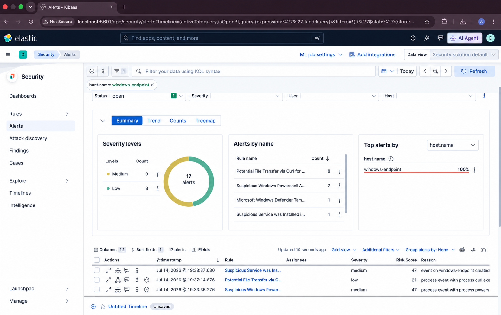

# Product Overview

## 1. Purpose

LogLookup AI is an investigation layer for Elastic Security. It retrieves security alerts, normalizes them to OCSF, groups related activity into deterministic attack chains, scores risk, and presents the resulting evidence in an analyst workspace. AI triage is optional and runs only after the chain has been formed.

The product does not replace Elasticsearch, Kibana, or Elastic Security. Elastic remains responsible for telemetry collection, detection, and storage. LogLookup AI focuses on connecting related alerts and making the resulting evidence easier to investigate.

*Figure 1. Incident list showing a correlated chain, verdict, risk score, event count, and primary entity.*

## 2. Problem Addressed

An investigation may begin with alerts from several rules but still describe one sequence of activity. Reviewing those alerts independently makes it harder to establish timing, shared entities, and attack progression.

LogLookup AI addresses this by:

- preserving the source alert evidence;
- normalizing detection fields into a common event structure;
- linking activity through hosts, users, processes, IP addresses, and time;
- assigning stable chain identifiers and cumulative entity risk;
- showing deterministic and AI-derived results separately; and
- writing the investigation result back to Elastic.

## 3. Product Principles

### Deterministic processing first

Pre-filtering, normalization, entity resolution, correlation, and risk scoring complete before AI reasoning. A model is not used to decide which unrelated alerts should become a chain.

### Evidence remains inspectable

The workspace exposes the event stream, raw JSON, correlation record, graph, entity context, and report. Analysts can compare an AI conclusion with the evidence that produced it.

### AI failure does not erase deterministic results

If the configured provider or ATT&CK knowledge base is unavailable, the system records an unavailable triage state and keeps the correlated chain available for review.

### Elastic remains part of the workflow

LogLookup AI reads Elastic alerts and writes enriched chain documents back to a configured results index. Dashboard deep links connect the Elastic result with the investigation view.

## 4. Capabilities

### Elastic Security integration

The Elastic connector supports authenticated alert retrieval, polling, bounded batch reads, connection checks, TLS configuration, and idempotent result write-back.

*Figure 2. Elastic Security alerts associated with one endpoint before correlation.*

### OCSF normalization

Incoming alerts are mapped to OCSF Detection Finding events (`class_uid` 2004). The normalizer standardizes timestamps, severity, event fields, and investigation entities while retaining the source record for evidence review.

### Entity resolution and correlation

The correlation engine links events by stable entities and event time. It handles configured time windows, late-arriving records, deduplication, and chain retention. Each chain receives a stable identifier in the form `CHAIN-YYYY-MM-DD-<entity>-NNN`.

*Figure 3. Correlated event stream with attack graph, verdict, raw evidence, and entity context.*

### Risk-based surfacing

Risk contributions are derived from normalized severity and accumulated for resolved entities. Chains cross the configured surfacing threshold deterministically. A conflicting tactic order can apply the configured misconfiguration downgrade.

### AI-assisted triage

For in-scope chains, the AI layer receives a bounded, structured evidence payload and retrieved MITRE ATT&CK candidates. It produces a verdict, confidence assessment, hypotheses, reasoning, and recommended actions. Local Ollama, Anthropic, and OpenAI providers are supported through the provider abstraction.

*Figure 4. AI verdict data shown alongside the entity context used during investigation.*

### Grounding validation

The validator checks that referenced evidence fields exist in the source payload and that technique identifiers came from the retrieved ATT&CK candidates. Invalid references affect validation and confidence rather than being presented as verified evidence.

### Investigation workspace

The browser interface provides:

- active, all, and AI-triaged incident views;
- searchable and filterable event tables;
- chronological MITRE lanes;
- 2D and 3D attack graphs;
- raw event and correlation JSON;
- AI verdict and case report tabs;
- entity context and related alerts; and
- JSON and Markdown export.

### Elastic write-back

Completed result documents include the chain, risk, triage state, report, and LogLookup AI dashboard URL. Writes are idempotent by `cluster_id`.

*Figure 5. Simulated correlated activity recorded in an Elastic Security case.*

## 5. Investigation Flow

1. Elastic Security produces alerts from detection rules.
2. LogLookup AI retrieves new records from the configured alert index.
3. The adapter normalizes each record to OCSF.
4. The pre-filter suppresses explicitly configured benign activity.
5. Entity resolution and correlation form deterministic chains.
6. Risk scoring determines which chains are surfaced.
7. In-scope chains receive optional AI triage and grounding validation.
8. The report and chain document are written to Elasticsearch when write-back is enabled.
9. Analysts review the result in Kibana or the LogLookup AI workspace.

*Figure 6. Structured correlation output with the stable chain identifier, time window, risk score, and primary entity.*

## 6. Deployment Scope

The included installer targets Linux and Python 3.11 through 3.13. It installs the application for the current user, adds a desktop entry, and configures a systemd user service when systemd is available. Development mode can run directly from a source checkout.

The current connector is Elastic Security. The normalization package contains adapter scaffolding for other sources, but those integrations are not documented as supported deployment paths.

## 7. Security and Privacy Controls

- Managed credentials are accepted write-only and stored in an encrypted local secret store.
- Configuration and status responses do not return API keys.
- Cloud use requires an explicit zero-data-retention acknowledgement.
- Optional tokenization replaces recognized sensitive values before a cloud request and restores them after the response.
- TLS verification is enabled by default; private CAs can be supplied without disabling verification.

These controls reduce exposure but do not replace an organization's review of provider terms, host security, access control, logging, retention, and incident-handling requirements.

## 8. Current Repository Scope

The repository contains the correlation engine, Elastic connector, AI and grounding layers, dashboard, Linux installer, example configuration, and automated tests. Operational readiness depends on the target environment, Elastic permissions, selected AI provider, TLS setup, and deployment validation.

## License

Copyright © Abhinav Kadam (RabbitEyesec). All rights reserved.

